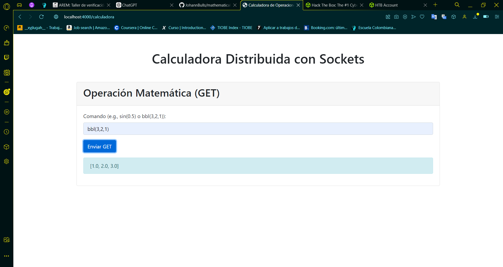

# Mathematical Operation Web Application

This project is a distributed web application that performs mathematical operations and list sorting using **Sockets** instead of frameworks like Spring or Spark. The application is composed of three main components:
- **Web Client (HTML + JavaScript)**: Sends mathematical commands to the service facade.
- **Service Facade (Java + Sockets)**: Acts as an intermediary between the web client and the calculator service.
- **Calculator (Java + Sockets)**: Performs mathematical operations using reflection and sorts lists using Bubble Sort.

## Prerequisites

To install and run the project, make sure you have the following installed on your system:

- [Java 17](https://www.oracle.com/java/technologies/javase-jdk17-downloads.html)
- [Apache Maven](https://maven.apache.org/install.html)
- [Git](https://git-scm.com/)

## Installation

1. **Clone the repository from GitHub**:

   Open a terminal and run the following command to clone the repository to your local machine:

   ```bash
   git clone https://github.com/JohannBulls/mathematicaloperation.git
   ```

   Change to the project directory:

   ```bash
   cd mathematicaloperation
   ```

2. **Compile the project**:

   Use Maven to compile the project. From the project root (where the `pom.xml` file is located), run the following command:

   ```bash
   mvn clean compile
   ```

## Running the Application

The project consists of two services that must be run independently: the **Calculator Service** and the **Service Facade**.

### 1. Run the Calculator

This service is responsible for performing the mathematical operations.

- In a terminal, run the following command to start the Calculator on port 5000:

   ```bash
   mvn exec:java -Dexec.mainClass="co.edu.escuelaing.ReflexCalculator"
   ```

You should see a message similar to:

```
Calculator ready on port 5000...
```

### 2. Run the Service Facade

This service acts as an intermediary between the web client and the calculator.

- In another terminal, run the following command to start the Service Facade on port 4000:

   ```bash
   mvn exec:java -Dexec.mainClass="co.edu.escuelaing.ServiceFacade"
   ```

You should see a message similar to:

```
Facade ready on port 4000...
```

### 3. Access the Web Application

Once both services are running, open a web browser and visit the following URL to access the web client:

```
http://localhost:4000/calculadora
```



### 4. Test Mathematical Operations

From the web client's interface, you can perform mathematical operations such as the following:

- **Sine**: `sin(0.5)`
- **Bubble Sort**: `bbl(3,2,1)`

The results will appear on the page without needing to reload it.

## Project Structure

The project has the following folder structure:


- `ReflexCalculator.java`: The service that performs mathematical operations.
- `ServiceFacade.java`: The service that acts as an intermediary between the web client and the calculator.
- `index.html`: The web client that sends requests to the server.